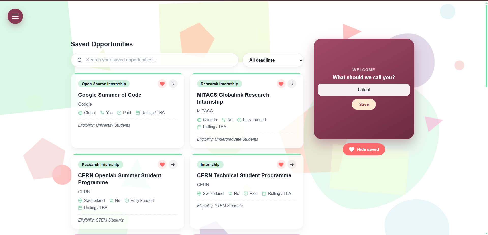
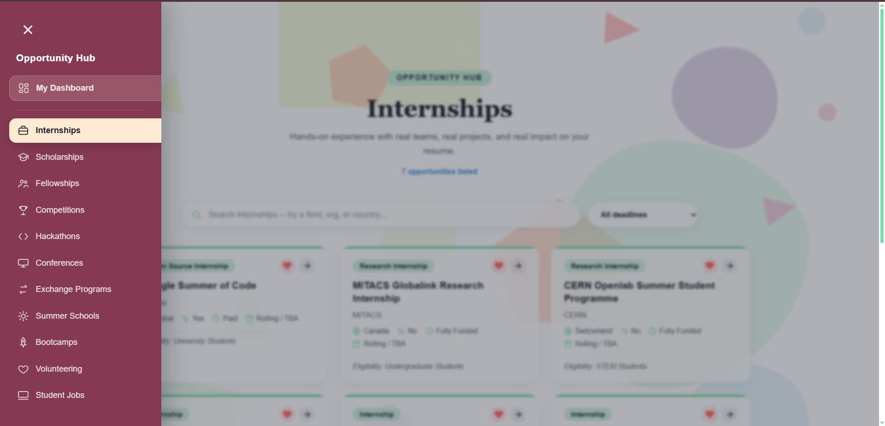

# 🎓 Students Opportunity Hub

> A modern, student-focused platform that brings scholarships, internships, bootcamps, competitions, fellowships, and other opportunities together in one place.

Students often have to search through dozens of websites, social media posts, university announcements, and scattered resources to find opportunities. **Students Opportunity Hub** aims to make that process easier by providing a centralized, organized, and visually engaging platform for discovering opportunities.

---

## Preview:

### Demo:
<br>

<a href="https://youtu.be/i5jhHqYD1f8?si=oVLytVh2OIGuPnif">
  
</a>

### DashBoard:

<p align="center">
  
</p>

### Side Nav Bar:

<p align="center">
  
</p>


---

## Features:

* **Explore Opportunities** — Browse opportunities from different categories.
* **Scholarships** — Discover scholarship opportunities for students.
* **Internships** — Find internships and career-building experiences.
* **Bootcamps** — Explore intensive programs designed to build practical skills.
* **Competitions** — Discover competitions, challenges, and student contests.
* **Fellowships** — Find fellowship programs and international opportunities.
* **Organized Categories** — Opportunities are grouped into dedicated categories for easier navigation.
* **Modern UI** — Clean, responsive interface designed with students in mind.
* **Responsive Design** — Designed to work across desktop and smaller screens.
* **Direct Opportunity Links** — Quickly access the official application or information page.

---

## Tech Stack:

| Technology       | Purpose                                     |
| ---------------- | ------------------------------------------- |
| **React**        | Building the user interface                 |
| **TypeScript**   | Type-safe development                       |
| **Vite**         | Development server and build tooling        |
| **CSS**          | Custom component and page styling           |
| **React Router** | Client-side page navigation                 |
| **PapaParse**    | Reading and processing CSV opportunity data |
| **Git & GitHub** | Version control and collaboration           |

---

## Getting Started:

### Prerequisites:

Make sure you have the following installed:

* [Node.js](https://nodejs.org/)
* npm
* Git

### 1. Clone the repository:

```bash
git clone https://github.com/syeda-hira-batool/Students-Opportunity-Hub.git
```

### 2. Navigate into the project:

```bash
cd Students-Opportunity-Hub
```

### 3. Install dependencies:

```bash
npm install
```

### 4. Start the development server:

```bash
npm run dev
```

Vite will provide a local development URL, usually:

```text
http://localhost:5173
```

Open the URL in your browser to view the application.

---

## How It Works:

The platform organizes opportunities into categories so students can quickly find what is relevant to them.

The general flow is:

```text
                 Students Opportunity Hub
                           │
                           ▼
                    Explore Platform
                           │
          ┌────────────────┼────────────────┐
          ▼                ▼                ▼
     Scholarships      Internships      Bootcamps
          │                │                │
          └────────────────┼────────────────┘
                           ▼
                    Opportunity Details
                           │
                           ▼
                    Official Opportunity
                         Website
```

---
## Future Improvements:

Some potential improvements for future versions include:

* Location and country filters
* Funding information
* Deadline reminders
* Personalized opportunity recommendations (using AI)
* Improved mobile experience
* Larger opportunity database
* Student contribution/submission system

---

## Why This Project?

Students encounter opportunities through many different channels — university announcements, social media, newsletters, websites, and communities.

This project explores how a centralized platform can make those opportunities:

**Discoverable → Organized → Accessible**

The goal is not just to create another listing website, but to build a useful resource that helps students discover opportunities they might otherwise miss.

---

## Author:

**Syeda Hira Batool**

Computer Science Student & Frontend Developer

* GitHub: [@syeda-hira-batool](https://github.com/syeda-hira-batool)
* LinkedIn: [Syeda Hira Batool](https://www.linkedin.com/in/syeda-hira-batool-759419371/)

---


This project is created for educational and portfolio purposes.
